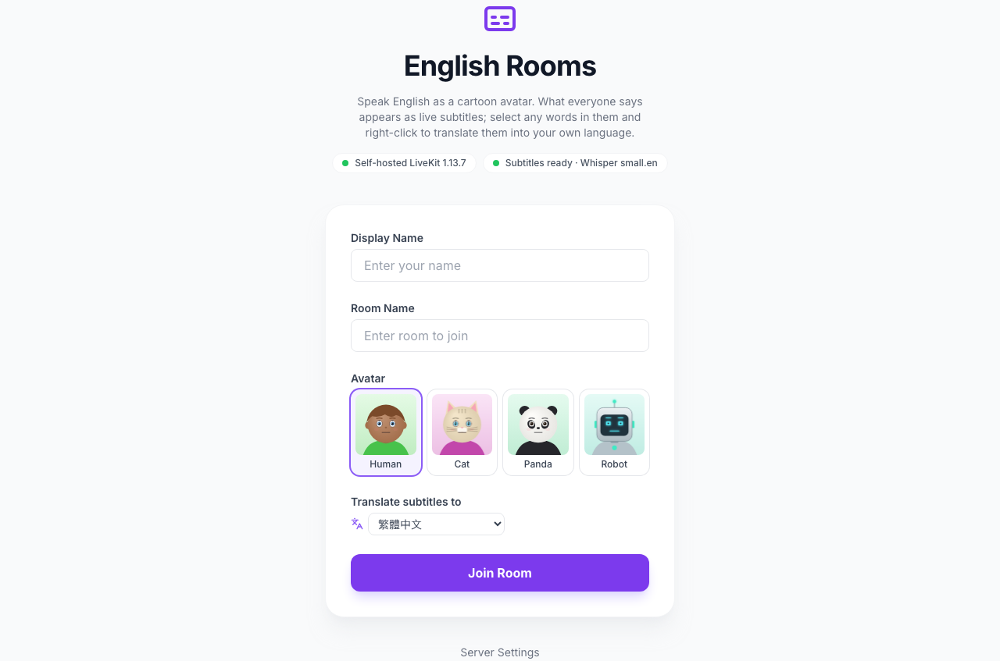
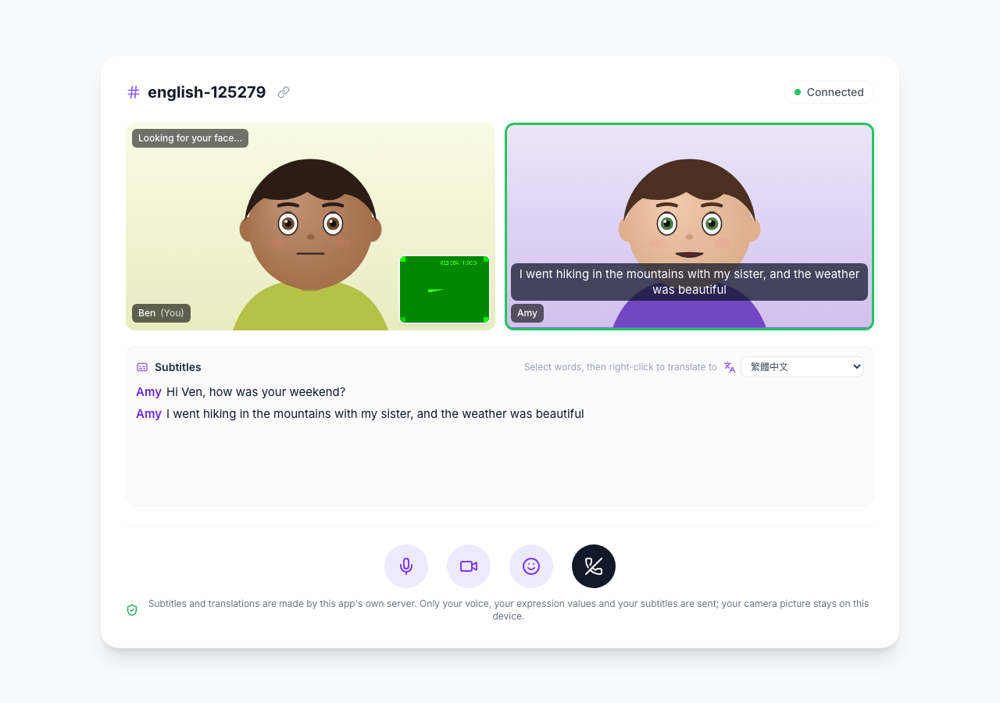

# Reflex DDNS LiveKit English Chat 💬

**English conversation as cartoon avatars, with live subtitles and translation on demand.** Whatever someone says turns into subtitles on everyone's screen while they speak. Select any words in them, right-click, and see them translated into your own language (繁體中文 by default, or any of 21 languages, chosen per person).

Everything runs on your own machines. Built with [Reflex](https://reflex.dev/) on a **self-hosted, open-source [LiveKit](https://github.com/livekit/livekit) server inside the app's own container**. Speech becomes text with **Whisper** ([faster-whisper](https://github.com/SYSTRAN/faster-whisper)) **inside the app's backend**, and words are translated by **a local LLM you run with [Ollama](https://ollama.com)**. No cloud account, no API keys.

It is the English-learning sibling of [reflex_ddns_livekit_avatar_chat](https://github.com/milochen0418/reflex_ddns_livekit_avatar_chat) and has the same avatars and face tracking: your camera picture never leaves your device, only your voice, 51 expression values and your subtitles do. Like [reflex_ddns_livekit_audio_chat](https://github.com/milochen0418/reflex_ddns_livekit_audio_chat) and [reflex_ddns_livekit_video_chat](https://github.com/milochen0418/reflex_ddns_livekit_video_chat), it has the same lobby, embedded server, `/settings` and `call.join` intent, so relack and codoc_in_md can call with it. All of them can be installed side by side.

## 📸 Interface Preview

| Lobby | Live subtitles | Right-click → Translate |
|:---:|:---:|:---:|
|  |  |  |

## 🌟 Features

- **Live subtitles**: what you say appears under your avatar as a caption and in the room's transcript, for everyone, including you (so you can see what was understood). The words show up while you speak, then each sentence settles at your pause.
- **Translate the words you don't know**: select a word, a phrase or a whole line in the subtitles and right-click: *Translate to 繁體中文*. The line it was said in goes along as context, so "bank" in *"the river bank"* and in *"go to the bank"* translate differently. On touch screens a *Translate* button appears under the selection.
- **Your language**: pick it in the lobby or above the transcript (繁體中文, 简体中文, 日本語, 한국어, Tiếng Việt, ไทย, Bahasa Indonesia, Español, Français, Deutsch, …). It is remembered in your browser, also inside other apps' call dialogs. Translations are only for you; the others keep reading English.
- **Self-hosted speech and language models**: Whisper runs in the app's backend (`small.en`, downloaded once). The translator is any chat model in your Ollama (default `qwen2.5:7b`). Chinese answers are kept in Traditional characters (OpenCC) when you asked for 繁體中文.
- **Mute = no subtitles**: muted, your microphone reaches neither the call nor the transcriber.
- **Avatars and face tracking** as in the avatar app: Human, Cat, Panda and Robot, driven by your face ([MediaPipe Face Landmarker](https://ai.google.dev/edge/mediapipe/solutions/vision/face_landmarker), on your device), idling with lip-sync when the camera is off. The token lets participants publish only their microphone, so the server refuses video.
- As in the other call apps: mute, leave, invite links, *Click to enable audio*, the embedded LiveKit server, `/settings`, the `call.join` intent, and nothing loaded from a CDN.

## 📐 How it works

```
Amy's browser                        this app's container
  microphone ─► Opus audio ────────► livekit-server ─────────────► everyone: Amy's voice
       │
       └──► 16 kHz PCM ──► WS /stt ─► Whisper (Reflex backend)
                                        partial text ~1/s, final text at each pause
  her subtitle ◄────────────────────────┘
       └──► data packet, topic "subtitle" ─► livekit-server ─► everyone: caption + transcript line

Ben's browser
  selects "mountains", right-click ─► POST /translate {words, their line, "zh-TW"}
                                        └─► Ollama (local LLM) ─► "山峰" in a popup, for Ben only
```

- **Subtitles** (`stt.py`, `assets/subtitles.js`, `assets/subtitle_worklet.js`): the speaker's own browser sends its microphone (the same track it publishes to LiveKit, with echo cancellation and noise suppression) as 16 kHz PCM to `/stt`. The backend cuts it into segments at pauses (by loudness) and transcribes each with Whisper: again and again while it grows (*partial*), then once more carefully at the pause (*final*). The browser passes each result on to the room as a reliable LiveKit data packet: `{"v": 1, "seg": 12, "text": "How was your weekend?", "final": true}`, topic `subtitle`.
- **Translation** (`translate.py`): `POST /translate` sends the selected words, their subtitle line and the target language to Ollama's chat API (temperature 0.1) and caches the answer.
- **Access**: `/stt` and `/translate` accept only a valid room token of this app's LiveKit server, so only people in a room use the models.
- **Speech model**: `WHISPER_MODEL` (default `small.en`, about 470 MB) is downloaded on the first start into the app's data directory and loaded at every backend start; the lobby shows *Downloading the speech model… 230 / 464 MB* / *Loading…* / *Subtitles ready*, and so does the subtitles header of calls opened in the meantime. Calls already open start their subtitles by themselves once the model is ready (words said before are not transcribed); nobody needs to rejoin. A 6-second sentence takes about 1 s on an Apple M4 Pro CPU (`int8`). Several people can speak at once (`WHISPER_WORKERS`).

Signalling and media take the same path as in the other apps: `https://english-chat.reflex-ddns.com/rtc` is relayed by the Reflex backend to `livekit-server` on `127.0.0.1:7680`, and media goes to the published ports TCP 7681 / UDP 7682 on the host's LAN IP (`EXTERNAL_IP`). The ports sit below the avatar chat's (7780-7782); the audio and video apps use 7880-7882 and 7980-7982.

| File | Role |
|------|------|
| `reflex_ddns_livekit_english_chat/stt.py` | Whisper model (loaded at start), the pause detector, the `/stt` WebSocket. |
| `reflex_ddns_livekit_english_chat/translate.py` | `/translate`, the languages, the Ollama call and its clean-up (quotes, romanization, Simplified → Traditional). |
| `assets/subtitles.js` | Microphone → `/stt`, subtitle packets in and out, captions and transcript, the right-click menu and the translation popup. |
| `assets/subtitle_worklet.js` | AudioWorklet: the microphone as 16 kHz 16-bit PCM in 100 ms chunks. |
| `assets/face_tracker.js`, `assets/avatar_face.js`, `assets/livekit_bridge.js`, `assets/mediapipe/` | Face tracking, avatars and the LiveKit client, as in the avatar app (face packet format in its README). |
| `reflex_ddns_livekit_english_chat/livekit_server.py`, `livekit_proxy.py` | The embedded LiveKit server and the `/rtc`, `/twirp` relays. |
| `backend-paths.txt` | Tells re-ddns nginx to send `/rtc`, `/twirp/`, `/stt` and `/translate` to the backend port. |

## 🦙 The translator: Ollama

Install [Ollama](https://ollama.com) on the machine (or another one on the LAN) and pull a chat model:

```bash
ollama pull qwen2.5:7b        # the default; good at Chinese, Japanese, Korean and Western languages
```

Any chat model works (`OLLAMA_MODEL`), e.g. `gemma3:12b` for more languages, or something smaller on a modest machine. The first translation after a while loads the model into memory, which takes a few seconds; the next ones take well under a second.

The app finds Ollama at `http://127.0.0.1:11434`, or at `http://host.docker.internal:11434` when it runs in Docker (re-ddns), i.e. on the Docker host. Elsewhere, set `OLLAMA_URL`.

## 🚀 Install on re-ddns (Agentic App Store)

A catalog entry for `re_ddns/data/appstore_catalog.json`:

```json
{
  "id": "ddns-livekit-english-chat",
  "name": "LiveKit English Chat (self-hosted)",
  "description": "English conversation as cartoon avatars with live subtitles (Whisper, self-hosted) and right-click translation of any words into your language (local LLM via Ollama).",
  "icon": "captions",
  "subdomain": "english-chat",
  "github_repo": "https://github.com/milochen0418/reflex_ddns_livekit_english_chat.git",
  "app_name": "reflex_ddns_livekit_english_chat",
  "branch": "main",
  "commit": "",
  "subdir": "",
  "env_file": "",
  "volumes": ["smart-app-english-chat-data:/root/.local/share/reflex_ddns_livekit_english_chat"],
  "ports": ["7681:7681", "7682:7682/udp"],
  "env_schema": [
    {"key": "OLLAMA_MODEL", "label": "Ollama model for translations", "placeholder": "qwen2.5:7b", "secret": false, "required": false,
     "help": "Any chat model pulled into Ollama on the Docker host (ollama pull qwen2.5:7b)."},
    {"key": "OLLAMA_URL", "label": "Ollama URL", "placeholder": "http://host.docker.internal:11434", "secret": false, "required": false,
     "help": "Leave empty for Ollama on the Docker host."},
    {"key": "ADMIN_PASSCODE", "label": "Admin Passcode (optional, unlocks /settings)", "placeholder": "", "secret": true, "required": false,
     "help": "LiveKit is built in; media ports 7681/tcp + 7682/udp."}
  ]
}
```

1. Install **LiveKit English Chat (self-hosted)** from `https://aapps.reflex-ddns.com`.
2. Open `https://english-chat.reflex-ddns.com`, pick a name, a room, an avatar and your language, allow camera and microphone, and share the invite link.

The first install downloads `livekit-server` (about 17 MB) and the speech model (about 470 MB; at Hugging Face's unauthenticated speed, about 1.5 MB/s, that takes around 5 minutes); later starts load the model in seconds. The app's data directory (model, keys, server binary) lives in the named Docker volume `smart-app-english-chat-data`, which outlives the container: re-installs and updates, in Dev mode too, reuse the model instead of downloading it again. `docker volume rm smart-app-english-chat-data` frees the space after an uninstall.

From the command line:

```bash
./smart_launch.sh -p 7681:7681 -p 7682:7682/udp \
  https://github.com/milochen0418/reflex_ddns_livekit_english_chat.git reflex_ddns_livekit_english_chat english-chat
```

## 💻 Run locally

Prerequisites: Python 3.11, [Poetry](https://python-poetry.org/docs/#installation), the LiveKit server binary (macOS: `brew install livekit`; Linux downloads it automatically) and, for translations, Ollama with a model (see above).

```bash
poetry env use python3.11
poetry install
poetry run ./reflex_rerun.sh
```

Open `http://localhost:3000`. Browsers only allow the camera and microphone on secure origins: `localhost` counts as one, but from another machine use HTTPS, e.g. through re-ddns.

`reflex_rerun.sh` also stops the detached `livekit-server` (port 7680) so the restarted backend starts a fresh one. Runtime files (binary, keys, config, `livekit-server.log`, `models/`) live in `~/Library/Application Support/reflex_ddns_livekit_english_chat` on macOS and in `~/.local/share/reflex_ddns_livekit_english_chat` on Linux.

> If the Docker deployment runs on the same machine, it owns ports 7681/7682. Run the local copy on other media ports:
> `LIVEKIT_RTC_TCP_PORT=7691 LIVEKIT_RTC_UDP_PORT=7692 poetry run ./reflex_rerun.sh`

## ⚙️ Configuration (all optional)

| Variable | Default | Purpose |
|----------|---------|---------|
| `WHISPER_MODEL` | `small.en` | Speech model: `tiny.en`, `base.en` (faster, less accurate), `small.en`, `medium.en` (slower, more accurate), or a local model directory. |
| `WHISPER_THREADS` / `WHISPER_WORKERS` | min(8, CPUs) / `2` | CPU threads per transcription / transcriptions at once (people speaking together). |
| `OLLAMA_URL` | `http://127.0.0.1:11434` (Docker: `http://host.docker.internal:11434`) | Where Ollama answers. |
| `OLLAMA_MODEL` | `qwen2.5:7b` | The chat model that translates. |
| `ADMIN_PASSCODE` | *(empty)* | Unlocks the admin part of `/settings`. |
| `LIVEKIT_NODE_IP` | `EXTERNAL_IP`, else auto | IP address browsers send audio and data to (`rtc.node_ip`). It can also be set on `/settings`. |
| `LIVEKIT_API_KEY` / `LIVEKIT_API_SECRET` | generated | Fixed credentials, e.g. to share the server with other apps. The secret needs 32+ characters. |
| `LIVEKIT_RTC_TCP_PORT` / `LIVEKIT_RTC_UDP_PORT` | `7681` / `7682` | ICE/TCP port and ICE/UDP mux port. These must match the published ports. |
| `LIVEKIT_PORT` | `7680` | Signalling/API port (localhost only). |
| `LIVEKIT_SERVER_BIN` | PATH, then download | Use a specific `livekit-server` binary. |
| `LIVEKIT_SERVER_VERSION` | `1.13.7` | Release downloaded on Linux. |
| `LIVEKIT_HOME` | see above | Directory for runtime files and the speech model. |
| `LIVEKIT_PUBLIC_URL` | the app's `api_url` | LiveKit URL handed to browsers. |
| `LIVEKIT_LOG_LEVEL` | `info` | livekit-server log level. |

## 🔗 Use this server from other *.reflex-ddns.com apps

The embedded server is a normal LiveKit server, so any LiveKit SDK can join the same rooms. To show subtitles there, send data packets with topic `subtitle` in the format above; to appear as an avatar, send face packets (format in the avatar app's README).

- **Client SDKs** (browser, mobile): `wss://english-chat.reflex-ddns.com`
- **Server SDKs** (tokens, RoomService): `https://english-chat.reflex-ddns.com` from the LAN, or `http://smart-app-english-chat:8000` from containers on the re-ddns network
- **API key / secret**: shown on `/settings` (admin), or chosen with `LIVEKIT_API_KEY` / `LIVEKIT_API_SECRET`.

## 📞 Calls from other apps (DDNS Intent `call.join`)

This app implements the same `call.join` contract as the audio, video and avatar chat apps, so callers such as relack and codoc_in_md need no change. The dialog loads `/intent/call-join`, which joins the LiveKit room right away (microphone on, subtitles and face tracking starting), and answers the caller when the user hangs up. Subtitles and translation work in the dialog too; its picture-in-picture window shows the subtitles (it takes no clicks, so translate after bringing the call back).

```python
from reflex_ddns_auth.intent import Intent, intent_host

# The caller picks the call app once (asked only when several are installed);
# MyState.app_chosen gets {"app": ...} and keeps it with the call...
rx.button("Call", on_click=Intent.choose_app("call.join", on_result=MyState.app_chosen))
# ...and everyone opens that app (data["app"]), so all end up in the same call:
Intent.start(
    "english-chat", "call.join",
    on_result=MyState.call_ended,   # {"status": "ended", "room": <room>} after hang up
    on_cancel=MyState.call_ended,   # {"reason": "closed" | "cancel" | "replaced" | ..., ...} otherwise
    private={"room": call_id},      # posted to the dialog, kept out of the URL
    keep_alive=True,                # other dialogs minimize the call instead of ending it
    single=True,                    # one call at a time: a new call closes the previous one
    label="Call · Design Review",   # shown in the tray while minimized
    title="Design Review", user="amy@example.com", name="Amy",
)
intent_host()  # once per page; delegates camera, microphone + autoplay to the dialog
```

| Param | Meaning |
|-------|---------|
| `room` | Required. Call id, used as the LiveKit room name. Everyone opening the same `room` with this app is in the same call. Use an unguessable id for private calls: the rooms themselves have no access control. Pass it with `private=` so it stays out of URLs and logs. |
| `title` | Shown instead of the id (e.g. the chat room's name). |
| `name` | Display name of the participant (shown with their subtitles). |
| `user` | Stable account id (e.g. an email), the base of the participant identity. |

The app publishes this contract, titled *English Call*, at `/_ddns_intent/manifest`, which the re-ddns intent registry reads, so callers can choose it next to the audio, video and avatar apps. Each app runs its own LiveKit server: everyone in a call must use the same app, which relack and codoc_in_md ensure (the caller chooses, the others follow). For local development of a caller without the registry: `DDNS_INTENT_PROVIDER_CALL_JOIN=english-chat DDNS_INTENT_URL_ENGLISH_CHAT=http://localhost:3000`.

## 🧪 Tests

Playwright suites live in `testcases/` (see [testcases/README.md](testcases/README.md)):

```bash
poetry run ./run_test_suite.sh smoke_home           # lobby, server + speech model ready, assets, /rtc relay, /translate gate
OLLAMA_MODEL=qwen2.5:7b poetry run ./run_test_suite.sh two_users_subtitles   # speech -> subtitles -> right-click translate
poetry run ./run_test_suite.sh two_users_avatar     # real face tracking, face packets, no video, expressions, controls
ADMIN_PASSCODE=test-pass poetry run ./run_test_suite.sh settings_admin
poetry run ./run_test_suite.sh call_intent          # call.join opened by a fake caller app, subtitles in the dialog
```

The fake microphones speak English generated at test time by macOS `say` (or `espeak-ng`), see `testcases/fixtures/speech.py`; the fake camera shows a public-domain portrait that MediaPipe tracks.

## 🩺 Troubleshooting

| Symptom | Fix |
|---------|-----|
| *Downloading the speech model… x / 464 MB* (also in calls from relack or codoc) | The first install downloads about 470 MB from Hugging Face, a few minutes; later starts only load it. Calls already open start their subtitles by themselves when it is done, no rejoin needed. Without internet, put a model directory in place and set `WHISPER_MODEL` to it. |
| My words don't become subtitles | Your browser must be allowed to process audio: click *Click to enable audio*, or anywhere on the page. Muted, nothing is transcribed. The line next to *Subtitles* says when the speech model is still loading or the connection to it is being restored. |
| Subtitles get some words wrong | Speak a little slower, nearer the microphone, and pause between sentences. A larger model (`WHISPER_MODEL=medium.en`) understands accents better but needs more CPU. |
| *Can't reach the translator (Ollama at …)* | Start Ollama. In Docker the app looks on the Docker host (`host.docker.internal`); if Ollama only listens on another machine, set `OLLAMA_URL`. On a Linux Docker host, start Ollama with `OLLAMA_HOST=0.0.0.0`. |
| *The translator model … is not installed* | `ollama pull <model>` on the Ollama machine, or set `OLLAMA_MODEL` to a model you have (`ollama list`). |
| Translations come in Simplified Chinese or with pinyin | Answers for 繁體中文 are converted to Traditional characters and romanization in brackets is removed; if a model still answers poorly, use a better one (`qwen2.5:7b` or larger). |
| *Looking for your face…* stays | Face the camera in good light, about an arm's length away. |
| Joined but silent, or stuck on *Connecting...* | Media can't reach the server. On `/settings`, *Media IP* must be the Docker host's LAN IP and the media ports must be published (`docker port smart-app-english-chat`). Allow UDP 7682 / TCP 7681 in the host firewall. |
| *address already in use* in the status | Another LiveKit instance holds 7681/7682 (e.g. the Docker deployment and a local run on the same Mac). Use other ports, see above. |
| *livekit-server not found on PATH* | macOS: `brew install livekit`. |
| No camera or microphone prompt from another machine over `http://` | Browsers only give camera and microphone to secure origins. Use `https://english-chat.reflex-ddns.com` (or `localhost`). |

## 📄 License

MIT, see [LICENSE](LICENSE). Bundled third-party files are Apache-2.0: [livekit-client](https://github.com/livekit/client-sdk-js) (`assets/livekit-client.umd.js`, v2.22.3), [MediaPipe Tasks Vision](https://github.com/google-ai-edge/mediapipe) and the Face Landmarker model (`assets/mediapipe/`, see its `NOTICE.md`), and the downloaded [livekit-server](https://github.com/livekit/livekit). Downloaded at run time: the Whisper model converted for CTranslate2 by Systran ([faster-whisper](https://github.com/SYSTRAN/faster-whisper), MIT; Whisper weights by OpenAI, MIT). The Ollama model you pull has its own license (Qwen2.5 7B: Apache-2.0). The test portrait is in the public domain (see `testcases/fixtures/README.md`).
